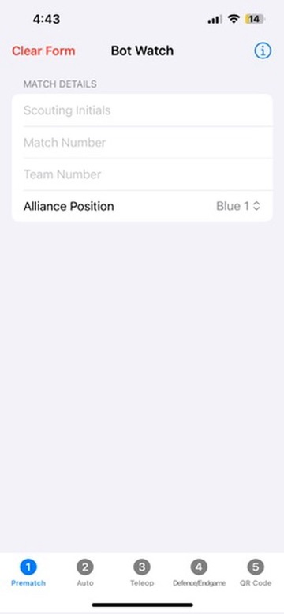
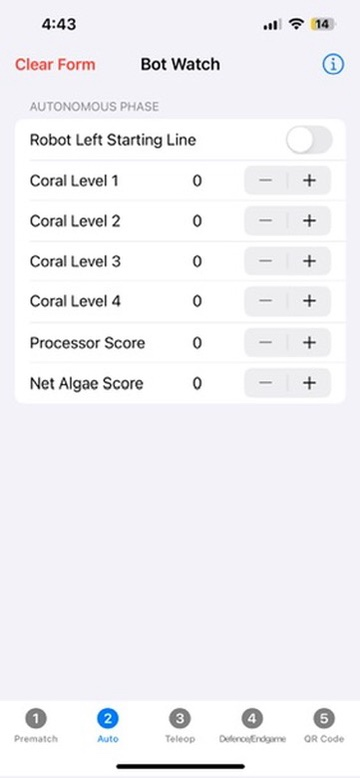
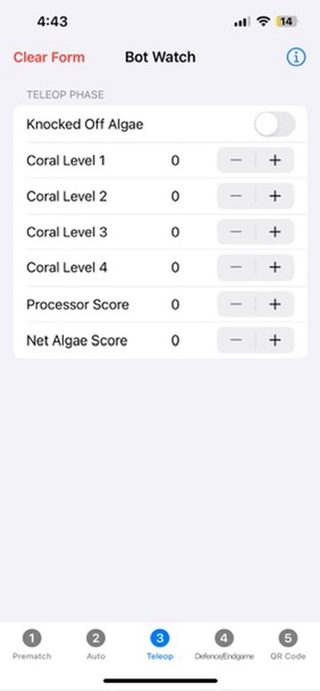
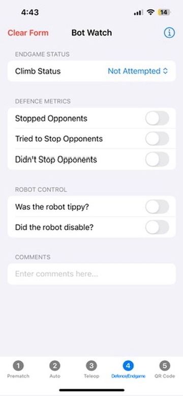
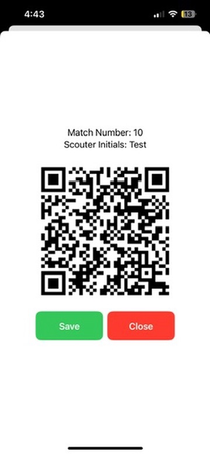
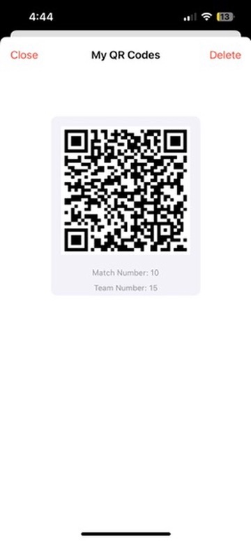

# Bot Watcher

Bot Watcher is a powerful and user-friendly iOS application designed to help teams participating in the FIRST Robotics Competition (FRC) efficiently scout and track match data. With features to record prematch details, autonomous and teleop performance, defensive plays, and endgame outcomes, the app also generates QR codes for easy data sharing. https://apps.apple.com/ca/app/botwatch/id6741486514

## Features

- **Prematch Data Input:** Log alliance positions and key match details.
- **Autonomous Performance Tracking:** Record robot performance during the autonomous phase.
- **Teleop Performance:** Track shooting and scoring during the teleoperated phase.
- **Defence and Endgame:** Log defensive actions and endgame attempts.
- **QR Code Generation:** Quickly generate QR codes for easy data sharing.
- **Info Button:** Displays credits for Team 2386 and the programming team.

## QR Code Data Structure

The QR code generated by Bot Watcher contains essential match data in a tab-delimited format (\t) for easy import into Excel or other spreadsheet applications. The encoded data includes:

- **Prematch Data Input:** Log alliance positions and key match details.
- **Autonomous Performance Tracking:** Record robot performance during the autonomous phase.
- **Teleop Performance:** Track shooting and scoring during the teleoperated phase.
- **Defence and Endgame:** Log defensive actions and endgame attempts.
- **QR Code Generation:** Quickly generate QR codes for easy data sharing.

## Data Handling and Security

- **Local Data Storage:** All information is stored locally on the device.
- **Offline Operation:** The app does not require internet access for its core functionalities.
- **Data Export:** Save QR codes as images for later scanning or sharing.

## Screenshots

| Prematch Screen | Auto Screen | Teleop Screen | Defence/Endgame Screen | QR Code Screen |
|:---------------:|:-----------:|:-------------:|:----------------------:|:--------------:|
|  |  |  |  |  |  |

## Installation

1. Clone this repository:
   ```bash
   git clone https://github.com/BCHRobotics/2025ReefScapeScouting.git
   ```

2. Open the project in Xcode.
3. Build and run the project on your preferred iOS simulator or physical device.

## Usage

1. Navigate through the tabs to enter various types of match data.
2. Use the "Clear Form" button to reset the form if needed.
3. Generate a QR code from the "QR Code" tab for easy data sharing.
4. Tap the "Info" button to view app credits.

## Requirements

- iOS 14.0 or later
- Xcode 12.0 or later

## Credits

Developed by Team 2386 Programming Team.
